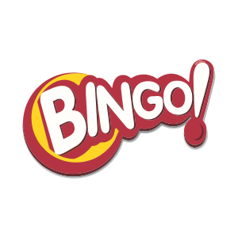

<h1 align="center">
   BINGO RED 
</h1>

<h1 align="center">
 
</h1>

> Bingo Manual 

# Sobre o Jogo

>Bingo manual, o sorteio ocorre como em um jogo físico, em que há um sorteio de bola a bola numeradas entre 1 e 90 e o jogador marca a cada número mostrado no seu próprio tempo de acordo com sua sorte e agilidade e o primeiro que informar que fez um “bingo” leva o prêmio. Podem ser compradas de 1 a 6 cartelas com 3 linhas e 5 colunas cada, com valores entre 1 e 90 aleatórios e ordenados de cima para baixo e da esquerda para a direita. Assim como no vídeo bingo, quanto mais cartelas compradas, mais chances de ganhar. O custo das cartelas não varia. O que varia e faz aumentar proporcionalmente a premiação é a quantidade de cartelas na rodada.

## 📚 Skills & Languages

    

## 👩‍💻 Veja o desenvolvimento do projeto:

## 💻 Protótipo
 Protótipo

## 🤝 Colaboradores

<table>
  <tr>
    <td align="center">
      <a href="#">
         
        
          <b>Bruno Dutra</b>
        
      </a>
    </td>
    <td align="center">
      <a href="#">
         
        
          <b>Diego Carravetta</b>
        
      </a>
    </td>
    <td align="center">
      <a href="#">
         
        
          <b>Fredy</b>
        
      </a>
    </td>
    <td align="center">
      <a href="#">
         
        
          <b>Guilherme Mattoso</b>
        
      </a>
    </td>
       <td align="center">
      <a href="#">
         
        
          <b>Nilson Reis</b>
        
      </a>
    </td>
       <td align="center">
      <a href="#">
         
        
          <b>Tiago Lima</b>
        
      </a>
    </td>
    </td>
  </tr>
</table>

## 📱 Contato

> BRUNO DUTRA  
 

> DIEGO CARRAVETTA  

> FREDY  

> GUILHERME MATTOSO  

> NILSON REIS   

> TIAGO LIMA   

